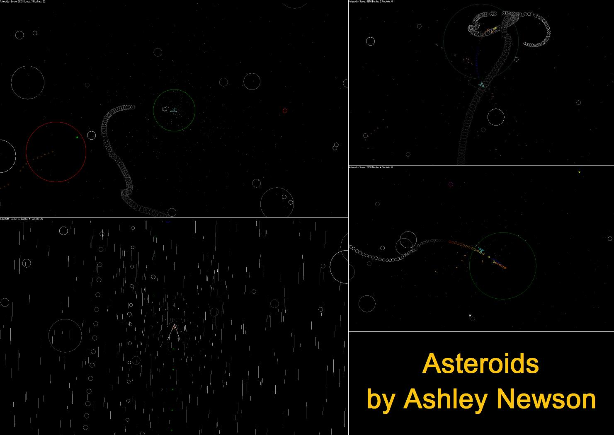

## Asteroids

### Description

This is an asteroids game that involves 3 weapons (bullets, lock-on rockets and bombs), 5 asteroid types including an explosive asteroid, warp power-up, stars, a flame and smoke trail and great configuration tools! It has a nice size universe with clever rap round system.

You control your ship with the mouse and keyboard:

Mouse: Aim, shot bullets and move

Ctrl/Alt: Fire asteroid seeking missile

Space: Drop Bomb

Esc/F11 can be used to toggle full screen

P/Pause Break will pause the game

F1 will Restart the game
 
### More Info
 
Keyboard Space and Ctrl/Alt Keys for Special Weapons, Keyboard P/Pause Break and Esc/F11 for Pause and Full screen

Mouse (X, Y and L and R buttons) for Main weapon and Movement

Main options window

Sound options window

configurable windowed/full screen graphical output.

optional sound output

Stars can use a lot of the CPU when at or near limit (8192), especially when blured.

             |
---                |---
**Submitted On**   |2008-12-28 15:48:26
**By**             |[Ashley Newson](https://github.com/Planet-Source-Code/PSCIndex/blob/master/ByAuthor/ashley-newson.md)
**Level**          |Advanced
**User Rating**    |5.0 (10 globes from 2 users)
**Compatibility**  |VB 6\.0
**Category**       |[Games](https://github.com/Planet-Source-Code/PSCIndex/blob/master/ByCategory/games__1-38.md)
**World**          |[Visual Basic](https://github.com/Planet-Source-Code/PSCIndex/blob/master/ByWorld/visual-basic.md)
**Archive File**   |[Asteroids2140101102009\.zip](https://github.com/Planet-Source-Code/ashley-newson-asteroids__1-71107/archive/master.zip)

